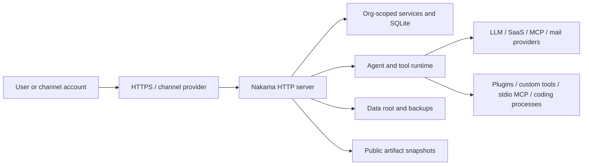

# Nakama Threat Model

This document is the technical security model for the architecture in
[`ARCHITECTURE.md`](./ARCHITECTURE.md). It is a review framework, not a
certification or a claim that every residual risk is closed.

**Reviewed revision:**
[`1a1113fc`](https://github.com/ahmadrosid/nakama/commit/1a1113fc6eb59b938a501e1d9d7e2f05e522f06e)

## Scope

In scope:

- the web, desktop, CLI, Telegram, WhatsApp, Discord, and Slack clients
- the Hono HTTP server, authentication, organization context, and role guards
- agent prompts, providers, tools, MCP, Composio, plugins, and coding harnesses
- workers, automations, notifications, attachments, and public artifact shares
- SQLite and the configured Nakama data root
- operator-controlled ingress, egress, backups, and deployment configuration

Out of scope:

- the internal security of external LLM, channel, SaaS, MCP, mail, or error
  tracking providers
- the host, hypervisor, container runtime, DNS, reverse proxy, and identity
  provider except where Nakama depends on their configuration
- guarantees made by a vulnerability-disclosure policy, DPA, or subprocessor
  list; those project commitments belong to
  [#1118](https://github.com/ahmadrosid/nakama/issues/1118)
- arbitrary code run through host `bash`, custom tools, stdio MCP, plugins, or
  coding agents after it leaves Nakama's own control flow

## Security objectives

1. A request can read or mutate only the organizations and capabilities its
   authenticated principal is allowed to use.
2. Credentials, messages, memory, files, and tool results do not cross an
   organization boundary through Nakama's application paths.
3. External data flow happens only through a configured or explicitly invoked
   feature and is visible to the operator.
4. Network and file inputs cannot silently turn into code execution with more
   privilege than the configured feature already has.
5. Security-relevant actions leave enough evidence to investigate, while logs
   avoid collecting request bodies and credentials by default.
6. A failed provider, worker, tool, or plugin does not corrupt durable state or
   make recovery impossible.

## Assets

| Asset | Why it matters |
| --- | --- |
| Provider, channel, mailbox, MCP, Composio, and error-tracking credentials | They authorize requests to external systems and can create cost or expose data. |
| Browser sessions, API keys, passkey credentials, TOTP secrets, backup codes, invite/reset tokens, and OAuth state | They establish user or integration identity. |
| Org membership and role assignments | They decide which tenant and mutations a principal can access. |
| Soul, memory, session history, todos, knowledge files, and attachments | They contain user and organization data and influence agent behavior. |
| Tool, skill, MCP, plugin, and automation configuration | They decide what code or external action an agent can invoke. |
| SQLite records and the Nakama data root | They are the durable source for tenant state and recovery. |
| Audit events, request IDs, worker logs, and error reports | They support attribution and incident investigation. |
| Public artifact-share tokens and snapshots | Possession grants unauthenticated access to a published copy until revocation. |

## Trust boundaries and assumptions

- TLS and public-port exposure are operator responsibilities. Nakama does not
  terminate TLS itself.
- The host and UID running Nakama are trusted. The stock container runs as
  non-root UID `1000`, but host-backed tools can access every mounted path that
  UID can access.
- Platform admins are trusted across organizations. Org admins are trusted to
  configure their organization, assign powerful capabilities, and invite
  members, but they are not trusted with another organization's data.
- Members can invoke assigned agents and capabilities. Viewers are read-only
  and cannot invoke agents or perform mutations.
- External providers receive the data required by the feature. Their retention,
  training, regional processing, and breach controls are outside Nakama.
- LLM output and remote tool output are untrusted input even when returned by a
  configured provider.

## STRIDE by component

Each section records the threat, the control present at the reviewed revision,
and the residual risk that still needs an operator decision or future work.

### 1. HTTP edge, authentication, and organization context

| STRIDE | Threat | Current control | Residual risk / verification |
| --- | --- | --- | --- |
| Spoofing | Stolen password, browser session, local token, org API key, or reset/invite token impersonates a principal. | Authentication middleware resolves the principal before org context. Tokens are hashed where durable verification is needed; passkeys and TOTP provide additional sign-in checks when enabled, and existing-user invite acceptance rechecks the user's password. | Require HTTPS, protect client devices and recovery codes, enforce MFA for privileged roles, rotate exposed credentials, and review the disclosure/auth policy tracked outside this document. |
| Tampering | A caller changes `X-Org-Id`, the active-org cookie, path org, or request body to target another tenant. | Org middleware rejects conflicting org sources, loads the organization, verifies membership, and returns not-found for inaccessible orgs. Route handlers use org and role guards. | New routes can bypass a guard if registered incorrectly. Authorization tests are required for every new org-scoped mutation. |
| Repudiation | A user denies a membership, invite, plugin, or other security-relevant change. | Request IDs connect responses to HTTP logs. Audit middleware records a fixed set of security events, including invite lifecycle events; audit rows reject update and delete. | Not every read or tool execution is an audit event. Define event coverage before claiming full administrative auditability. |
| Information disclosure | Errors, logs, unauthenticated routes, or cross-org lookups reveal credentials or tenant existence. | HTTP logs omit URLs, bodies, and credentials. Org access failures use not-found. Public routes are explicit. Error tracking scrubs known secret shapes before sending. | Local process and tool logs are not a universal scrubber. Debug logs and third-party error retention remain operator concerns. |
| Denial of service | Login attempts, large requests, streaming turns, or expensive provider calls exhaust CPU, memory, database capacity, or provider quota. | Request/body limits, tool/provider deadlines, streaming cancellation, and selected rate limits bound some paths. Health and readiness endpoints expose local service state. | A single host and shared provider quotas remain common failure domains. Apply proxy rate limits and container/provider budgets. |
| Elevation of privilege | A viewer invokes an agent; a member performs an admin/platform mutation; an org admin reaches platform routes. | `requireNotViewer`, org-admin, org-admin-or-platform-admin, and platform-admin guards separate those authorities. | A compromised platform admin is a full-control event. Keep platform-admin accounts rare and test guard placement during review. |

Evidence anchors: `apps/server/src/http/app.ts`,
`apps/server/src/http/org-middleware.ts`, `apps/server/src/http/org-guards.ts`,
`apps/server/src/http/audit-log.ts`, and `apps/server/src/services/auth-service.ts`.

### 2. Tenant data, profiles, sessions, and persistence

| STRIDE | Threat | Current control | Residual risk / verification |
| --- | --- | --- | --- |
| Spoofing | A profile, session, attachment, or member identifier from another org is presented as local. | Services resolve records with active org/profile context and reject missing or mismatched ownership. | Identifier checks must stay adjacent to every new read/write path; raw database helpers are not an authorization boundary by themselves. |
| Tampering | A user edits another profile's soul, memory, session, skill, or attachment through path traversal or an unscoped update. | Profile workspaces resolve below org/profile roots; service and database operations carry org identifiers; filesystem helpers constrain managed paths. | Host tools and third-party code run with process filesystem access and can bypass service-level checks. Treat their assignment as code-execution authority. |
| Repudiation | Durable data changes cannot be tied back to a principal. | Selected HTTP mutations enter the audit log and sessions preserve message history. | Direct filesystem writes by tools and child processes are not comprehensively attributed. |
| Information disclosure | SQLite, the data root, export ZIP, or a backup exposes every tenant and credential. | The stock image runs as non-root. Sensitive generated files and staging areas use private modes. Export/import is platform-admin only. | The data root and backups remain high-value plaintext to the service account. Encrypt backup storage and restrict host access. |
| Denial of service | One org fills disk with messages, attachments, artifacts, plugin data, or automation history. | File and payload limits exist on selected upload and extraction paths. | There is no claim of complete per-org disk or provider-cost quotas. Monitor capacity and enforce host-level limits. |
| Elevation of privilege | A lower role changes membership, tools, plugins, or org policy. | Mutation authority follows route guards and the role table in `ARCHITECTURE.md`. | Recheck authorization when a feature moves between platform and org scope. |

Evidence anchors: `packages/db/sql/schema.sql`,
`packages/db/src/adapters/sqlite.ts`, `packages/core/src/soul/resolve.ts`,
`apps/server/src/services/profile-service.ts`, and
`apps/server/src/services/data-portability.ts`.

### 3. Agent, provider, prompt, and built-in tool runtime

| STRIDE | Threat | Current control | Residual risk / verification |
| --- | --- | --- | --- |
| Spoofing | A malicious page, document, model response, or tool result pretends to be system or user authority. | System, user, assistant, and tool messages are structured separately; tool calls are matched to registered definitions. | Prompt injection is not solved by message roles. Agents can still choose a harmful assigned tool call. Keep authority narrow and require human review for consequential actions. |
| Tampering | A provider or replayed tool result changes arguments or conversation state. | Provider adapters normalize tool-call IDs/arguments and persistent session history records the resulting messages. | External providers remain trusted for transport integrity after TLS; application semantics are probabilistic. |
| Repudiation | A generated action cannot be connected to its prompt or tool call. | Session messages and tool call/results are persisted; automation runs retain outcomes. | Child-process side effects and remote SaaS audit logs must be correlated separately. |
| Information disclosure | Prompts, files, memory, or tool output are sent to the wrong provider or arbitrary URL. | Profiles resolve an explicit provider and assigned tools. The outbound inventory documents each boundary. `web_fetch` blocks private/reserved targets, revalidates redirects, and pins verified DNS addresses. | Users and agents can intentionally send data to public sites, model providers, browsers, or custom endpoints. Review profile assignments and provider retention. |
| Denial of service | Infinite tool loops, stalled streams, huge documents, or repeated model calls consume resources and quota. | Provider fetch deadlines, tool-loop bounds, output pruning, size limits, cancellation, and automation state limit individual paths. | Cost and concurrency across orgs still need operational monitoring and provider-side budgets. |
| Elevation of privilege | An agent invokes `bash`, browser, email, MCP, or another capability not intended for that profile. | Tool resolution is profile-scoped; viewers cannot invoke agents; unavailable tools are not included in the model's tool set. | Assignment grants meaningful authority. Host `bash`, custom code, browser sessions, and coding agents are not tenant sandboxes. |

Evidence anchors: `apps/server/src/services/agent-service.ts`,
`packages/agent/src/tool-loop.ts`, `packages/core/src/tools/`,
`packages/core/src/fetch-idle.ts`, and `packages/core/src/tools/web-fetch.ts`.

### 4. MCP, Composio, plugins, skill scripts, custom tools, and coding harnesses

| STRIDE | Threat | Current control | Residual risk / verification |
| --- | --- | --- | --- |
| Spoofing | A fake MCP, OAuth endpoint, package, or executable impersonates the configured integration. | HTTP MCP uses the configured URL/headers and OAuth state. Composio sessions return scoped MCP details. npm plugin install accepts exact package versions from `registry.npmjs.org`. | Admin-supplied URLs and local executables remain trust decisions. Validate ownership and TLS outside Nakama. |
| Tampering | A package or downloaded binary is replaced between selection and install. | npm plugins require published SHA-512 integrity and ignore install scripts. The runtime `omni` download is pinned and checked against release checksums. Official plugins ship with Nakama. | Checksums from the same release do not protect against a compromised publisher. Desktop, skill, git, and child-process supply chains remain external. |
| Repudiation | A remote tool action or plugin side effect is not attributable. | Composio associates connections with Nakama users; tool calls remain in session history; plugin actions pass through the host request bridge. | Remote provider logs and arbitrary child-process effects are not normalized into one audit trail. |
| Information disclosure | Tool arguments, workspace files, environment secrets, or SaaS data cross an unexpected boundary. | MCP and Composio are assigned per profile/toolkit; plugin packages declare contributions; secrets are masked in settings responses. Member-authored skill code requires approval before host execution. | Plugin workers, stdio MCP, skill scripts, custom JS/Python, `bash`, and coding agents can read and transmit anything available to the service UID. Review code and isolate egress. |
| Denial of service | A server, plugin, or child process hangs, floods output, or consumes CPU/memory. | HTTP/tool deadlines, output limits, worker lifecycle management, and process cleanup bound selected paths. | A hostile process can still exhaust its container or host without external resource controls. |
| Elevation of privilege | Installed code escapes the narrower HTTP/tool authorization model. | Plugin installation and lifecycle changes require administrative authority; profile assignment limits model-visible tools. | Once code runs under the Nakama UID, the UID is the effective boundary. Use a separate host/container for untrusted code. |

Evidence anchors: `apps/server/src/services/mcp-client-manager.ts`,
`apps/server/src/services/mcp-oauth.ts`,
`apps/server/src/services/composio-service.ts`,
`apps/server/src/services/plugin-service.ts`,
`apps/server/src/services/custom-tool-handlers.ts`, and
`apps/server/src/services/coding-agent-harness-service.ts`.

### 5. Channels, workers, automations, and notifications

| STRIDE | Threat | Current control | Residual risk / verification |
| --- | --- | --- | --- |
| Spoofing | An unapproved Telegram, Discord, Slack, or WhatsApp account sends commands as a member. | Channel tokens authenticate the platform connection. Pairing/allowed-user configuration and org/profile mapping gate inbound identities. | A stolen channel account or bot token is valid to the upstream platform. Revoke it upstream and rotate local configuration. |
| Tampering | A replayed, edited, or cross-org event mutates the wrong session or delivers to the wrong destination. | Channel mappings, owner claims, per-chat locks, platform message IDs, and org-scoped worker configuration bind events to a target. | Upstream delivery semantics and compromised platform accounts remain outside Nakama. |
| Repudiation | A channel action lacks a human identity or delivery receipt. | Platform user/chat identifiers and session messages preserve the transport identity; automation runs store status and delivery results. | Shared channel accounts weaken attribution. Use individual accounts and upstream audit features where available. |
| Information disclosure | Messages, attachments, artifact links, or typing state go to the wrong chat or platform. | Delivery adapters require configured destination IDs; artifact sharing publishes a snapshot only after an explicit action. | Public share links are bearer capabilities and channel providers receive message content and metadata. Verify destinations before enabling automations. |
| Denial of service | Message floods, reconnect loops, or a stuck automation consume workers and provider quota. | Chat locks, reconnect backoff, worker state, run status, and provider/tool deadlines limit individual loops. | Upstream floods and shared quotas still need platform-side limits and host monitoring. |
| Elevation of privilege | A channel user invokes an agent/profile they were not meant to use. | Pairing and org/profile mappings choose the accessible profile; server-side org and viewer guards still apply to API work. | A permissive allowed-user configuration is an operator-granted escalation. Review it after channel ownership changes. |

Evidence anchors: `apps/platform/{telegram,whatsapp,discord,slack}/src/`,
`apps/platform/automation/src/`, `packages/core/src/channels/`,
`apps/server/src/services/automation-service.ts`, and
`apps/server/src/services/automation-delivery-service.ts`.

### 6. Attachments, artifact shares, logs, and backups

| STRIDE | Threat | Current control | Residual risk / verification |
| --- | --- | --- | --- |
| Spoofing | An attacker guesses a public artifact URL or presents another org's share ID. | Share tokens are random and stored hashed. Authenticated publish/status/revoke operations resolve the org and profile. | A copied share URL is sufficient to read its snapshot; it has no automatic expiry at the reviewed revision. Revoke it when no longer needed. |
| Tampering | A shared file changes after review or an executable artifact runs in a browser. | Publishing creates a snapshot. Refresh replaces that snapshot deliberately. Browser-executable MIME types are forced to download rather than render inline. | A downloaded file can still be dangerous to its recipient. Scan or restrict artifacts according to operator policy. |
| Repudiation | A share, export, restore, or deletion cannot be investigated. | Share records contain creator/time and support revocation; selected events enter the audit log; restore is an explicit confirmed operation. | Files copied directly from the data root bypass application logging. |
| Information disclosure | Public links, local logs, exports, or backup media expose messages, files, credentials, or tenant data. | Public reads require the bearer token; error reports are scrubbed; exports are platform-admin operations. | Local logs and backups are sensitive. Encrypt backups, restrict log access, and avoid publishing secrets as artifacts. |
| Denial of service | Large uploads, shares, logs, or backups consume disk and block SQLite writes. | Selected size limits and bounded queues apply to attachments, document extraction, reports, and plugin packages. | Capacity is a host-level responsibility; monitor disk and test restore time. |
| Elevation of privilege | Crafted archive paths, MIME types, or restore contents write outside the data root or execute. | Import and managed-file helpers normalize paths, stage changes, and set private modes; executable browser types are not rendered inline. | Treat every backup as trusted administrative input. Restore only archives from a controlled chain. |

Evidence anchors: `packages/core/src/channel-artifacts.ts`,
`apps/server/src/services/attachment-service.ts`,
`apps/server/src/services/artifact-share-service.ts`,
`apps/server/src/services/data-portability.ts`, and
`packages/core/src/error-tracking-sentry.ts`.

### 7. Deployment, desktop client, and availability

| STRIDE | Threat | Current control | Residual risk / verification |
| --- | --- | --- | --- |
| Spoofing | A user connects to a fake Nakama origin or update feed. | The CLI pins saved sessions to the configured origin. Packaged desktop updates use the configured Nakama GitHub release feed. | Operators must provide trusted DNS/TLS. The software supply chain and code-signing policy are external review items. |
| Tampering | A proxy strips headers, buffers SSE, or a mutable image changes between environments. | Deployment docs specify public origin and SSE proxy behavior; release artifacts and plugin packages carry integrity metadata where supported. | Pin tested image tags/digests and control proxy configuration. `latest` is convenient, not immutable. |
| Repudiation | Operational changes cannot be reconstructed. | Structured logs, request IDs, image versions, audit events, and automation history provide evidence. | Host firewall, proxy, container, and secret-manager changes need the operator's own audit trail. |
| Information disclosure | Port `4310`, `/metrics`, the data volume, or debug output becomes public. | Metrics are off by default. The stock container is non-root and stores data under the mounted root. | TLS, firewalling, volume permissions, and metrics isolation are not automatic. Follow the hardening guide. |
| Denial of service | One server, SQLite database, provider, or channel outage stops service. | Liveness/readiness probes, worker restart management, timeouts, and backup/restore flows support recovery. | The default topology is a single-container, single-database deployment. High availability is not claimed. |
| Elevation of privilege | Privileged containers or broad mounts turn a service compromise into host compromise. | The stock image uses UID `1000` and requires no privileged mode for normal operation. | Adding root, `--privileged`, Docker socket, host home, or devices broadens the boundary and is an operator decision. |

Evidence anchors: `Dockerfile`, `docker-compose.yaml`, `apps/server/src/index.ts`,
`apps/desktop/main.mjs`, `apps/desktop/electron-builder.yml`, and
`apps/cli/src/setup.ts`.

## Residual-risk register

| ID | Risk | Owner / treatment |
| --- | --- | --- |
| R1 | TLS, firewalling, reverse proxy behavior, data-at-rest encryption, backup encryption, and host permissions are not enforced by Nakama. | Operator; follow [deployment hardening](./docs/website/content/docs/deployment-hardening.mdx); native secrets-at-rest work is tracked in [#364](https://github.com/ahmadrosid/nakama/issues/364). |
| R2 | Provider, channel, Composio, MCP, mail, and error-tracking services receive configured data and apply their own retention policy. | Operator/project policy; use the [outbound inventory](./docs/website/content/docs/outbound-connections.mdx) and #1118. |
| R3 | Prompt injection can drive an assigned high-authority tool. | Org/profile admin; minimize assignments and require review for consequential actions. |
| R4 | Host `bash`, skill scripts, custom code, stdio MCP, plugins, browser automation, and coding agents can create arbitrary egress and access service-readable mounts. | Operator; isolate the runtime or leave these capabilities unassigned. |
| R5 | Public artifact shares are bearer links without automatic expiry. | Publisher/operator; distribute carefully and revoke manually. |
| R6 | Org admins can still use the deliberate direct-add membership path outside the invite-domain slice. | Product decision tracked in [#375](https://github.com/ahmadrosid/nakama/issues/375). |
| R7 | The default deployment is a single host and SQLite database without a complete per-org resource quota claim. | Operator/product; monitor capacity, apply external limits, and test restores. |
| R8 | Vulnerability response commitments and legal processor/subprocessor statements are not defined by this technical model. | Project maintainers in [#1118](https://github.com/ahmadrosid/nakama/issues/1118). |

## Security-review map

This is the short route through common CAIQ-style questions:

| Review topic | Evidence |
| --- | --- |
| Architecture and trust boundaries | Scope, trust boundaries, and STRIDE sections in this document |
| Authentication, roles, tenant isolation, and privileged access | STRIDE sections 1 and 2 in this document |
| Data categories, external transfers, and feature triggers | [Outbound connections](./docs/website/content/docs/outbound-connections.mdx) |
| Encryption in transit and network exposure | [Deployment hardening](./docs/website/content/docs/deployment-hardening.mdx) |
| Storage, backup, restore, and deletion boundaries | STRIDE sections 2 and 6 in this document; recovery controls in [Deployment hardening](./docs/website/content/docs/deployment-hardening.mdx) |
| Logging, auditability, and error reporting | STRIDE sections 1 and 6 in this document |
| Secure configuration and operational verification | [Deployment hardening](./docs/website/content/docs/deployment-hardening.mdx) |
| Vulnerability disclosure, response commitments, DPA, and subprocessor policy | [#1118](https://github.com/ahmadrosid/nakama/issues/1118) |

## Maintenance rule

Review this model and the outbound inventory when a change adds or changes any
of these:

- an authentication mode, public route, org scope, role, or mutation guard
- a provider, network call, channel, notification destination, or OAuth flow
- a builtin tool, custom-tool capability, MCP transport, Composio action, plugin,
  coding harness, or child process
- a stored credential, data-root path, backup/export item, attachment, or public
  sharing path
- a deployment port, health/metrics endpoint, desktop update path, or runtime UID

For each change, update the relevant STRIDE row, residual risk, evidence anchor,
and outbound-inventory row in the same pull request.
